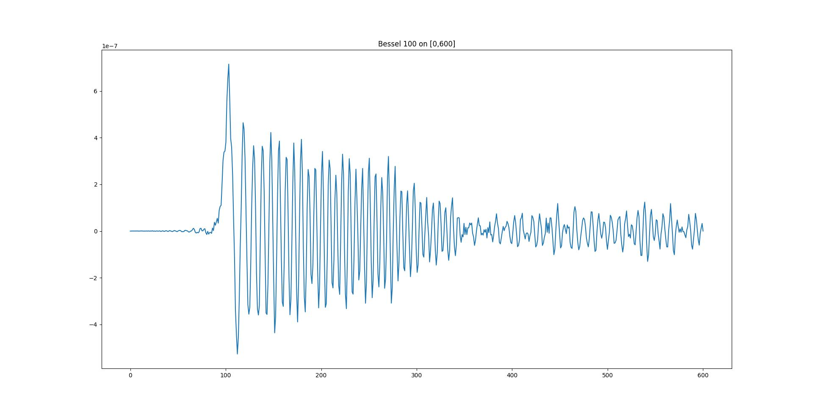

# Adaptive-BVP

### Course Project, Numerical Analysis, Spring 2023 ###
Implementation of the [A fast adaptive numerical method for stiff two-point boundary value problems](https://math.nyu.edu/~greengar/lee_gr_tpbvp.pdf) by June-Yub Lee and Leslie Greengard. Below is a full report.


## Contents
- [Introduction](#introduction)
- [Linear solver](#linear-solver)
- [Nonlinear Solver](#nonlinear-solver)
- [Examples](#examples)
- [Adaptivity](#adaptivity)
- [FAQ](#faq)
- [Advantages and defects](advantages-and-defects)

## Introduction
This project contains a single Python program named `BVPSolver.py`. To use the program, run
```Python
import BVPsolver
```
or
```Python
from BVPsolver import LinearBVPSolver, NewtonNonlinearSolver
```

This program contains 2 main functions, `LinearBVPSolver` for linear BVPs, and `NewtonNonlinearSolver` for nonlinear BVPs.

## Linear solver

To solve linear equations, please use `LinearBVPSolver` function. The function `LinearBVPSolver` has the following parameters:
```Python
def LinearBVPSolver(p, q, f, a, c, zetal0, zetal1, gammal, zetar0, zetar1, gammar,
    C=4.0, TOL=1e-8, iters=40, eval_points=32, force_double=False):
```
This function aims to solve the following ordinary differential equation:
$$u''(x) + p(x) u'(x) + q(x) u(x) = f(x)$$
with respect to boundary conditions:
$$\zeta_{l0} u(a) + \zeta_{l1} u'(a) = \gamma_l$$
and
$$\zeta_{r0} u(c) + \zeta_{r1} u'(c) = \gamma_r$$.

- `p`: A function defined on $[a,c]$ and returns a `float` number.
- `q`: A function defined on $[a,c]$ and returns a `float` number.
- `f`: A function defined on $[a,c]$ and returns a `float` number.
- `a`: A `float` number for the left boundary of the interval.
- `c`: A `float` number for the right boundary of the interval.
- `zetal0, zetal1, gammal, zetar0, zetar1, gammar`: `float` numbers determining the boundary conditions $\zeta_{l0} u(a) + \zeta_{l1} u'(a) = \gamma_l$
 and 
$\zeta_{r0} u(c) + \zeta_{r1} u'(c) = \gamma_r$.
- `C`: A `float` number with the same meaning described in the article. Default to 4.0.
- `TOL`: Error tolerance, default to 1e-8.
- `iters`: Number of allowed refinement iterations to solve the equation to the given error tolerance. Default to 40.
- `eval_points`: This program calculates the function values at `eval_points` random points on $[a,c]$ to estimate the error. Default to 32.
- `force_double`: The algorithm in the article contains one last doubling step, splitting every subinterval node into two to ensure that error stays within `TOL`. In my experiments, this step is usually unnecessary and doubles the execution time. Default to `False`. Switch it to `True` to force the same behavior described in the article.

This function returns a class `LinearBVPSolver.Node` that is directly callable. If you have already set `u = LinearBVPSolver(...)`, then you can:
- Access function value at `x`, i.e., $u(x)$, by direclty calling `u(x)`.
- Access function derivative at `x`, i.e., $u'(x)$, by calling `u(x, deriv=True)`.
The function value or derivative at `x` is computed by Chebyshev interpolation, which is more accurate than linear or spline interpolation.

Example usage:

```Python
from scipy.special import jv
from matplotlib import pyplot as plt
import numpy as np
from BVPSolver import LinearBVPSolver
u = LinearBVPSolver(
    lambda x: 1/x,
    lambda x: 1-(100/x)**2,
    lambda x: 0,
    0, 600,
    1,0,0,
    1,0,1,
    TOL=5e-10,
)
xs = np.linspace(0, 600, 600)
plt.plot(xs, [u(xi) for xi in xs])
plt.title("Bessel 100 on [0,600]")
plt.show()
```


## Nonlinear solver

The function `NewtonNonlinearSolver` has the following parameters:
```Python
def NewtonNonlinearSolver(
    f, f_2, f_3, a, c, zetal0, zetal1, gammal, zetar0, zetar1, gammar,
    initial=None, C=4.0, TOL=1e-6, iters=10, eval_points=32, force_double=False,
):
```
This function aims to solve the following ordinary differential equation:
$$u''(x) = f(x, u, u')$$
with respect to boundary conditions:
$$\zeta_{l0} u(a) + \zeta_{l1} u'(a) = \gamma_l$$
and
$$\zeta_{r0} u(c) + \zeta_{r1} u'(c) = \gamma_r$$.

- `f`: A function that accepts 3 `float` numbers (namely `x, u, du` where `du` is $u'(x)$) and returns a `float` number.
- `f_2`: Partial derivative of `f` with respect to the second parameter, which is $\partial_2 f$. It also accepts 3 `float` numbers (namely `x, u, du` where `du` is $u'(x)$) and returns a `float` number.
- `f_3`: Partial derivative of `f` with respect to the third parameter, which is $\partial_3 f$. It also accepts 3 `float` numbers (namely `x, u, du` where `du` is $u'(x)$) and returns a `float` number.
- `a`: Same as above
- `c`: Same as above
- `zetal0, zetal1, gammal, zetar0, zetar1, gammar`: Same as above
- `initial`: Provide an initial guess for the Newton's method. Default to `None`. If you want to provide an initial guess, set `initial=(u0,du0)` where `u0` is the initial guess function and `du0` is its derivative.
- `C`: Same as above
- `TOL`: Error tolerance, default to 1e-6.
- `iters`: Maximum number of Newton iterations to solve the equation. Default to 10.
- `eval_points`: Same as above
- `force_double`: Same as above

This function also returns a class `LinearBVPSolver.Node` that is callable as a function. See above for details.

The formula of Newton's iteration is not explicitly specified in the article. Here is the formula:

Let $u_{n+1}(x)$ solve 
```math
u''_{n+1} -\partial_3 f(x, u_n, u'_n) u'_{n+1} -\partial_2 f(x, u_n, u'_n) u_{n+1}=f(x, u_n, u'_n) -\partial_3 f(x, u_n, u'_n) u'_n -\partial_2 f(x, u_n, u'_n) u_n
```

Try this example, or see the example 5 below for details:
```Python
from matplotlib import pyplot as plt
import numpy as np
from BVPSolver import NewtonNonlinearSolver
r = NewtonNonlinearSolver(
    lambda x, u, du: 2*u*du,
    lambda x, u, du: 2*du,
    lambda x, u, du: 2*u,
    -np.pi/4, np.pi/4,
    1,0,-1,
    1,0,1,
    initial=(lambda x: x**2, lambda x: 2*x),
    TOL=1e-13
)
xs = np.linspace(-np.pi/4, np.pi/4, 100)
plt.plot(xs, [r(xi) for xi in xs])
plt.title("u''=2uu', u=tanx")
plt.show()
```


## Examples
The program is tested across six different examples. Run `python BVPSolver.py` to show all the examples.

Note: All following plots plot the difference of the computed solution and the real sulution.

In all these experiments, we set `K = 16`, namely 16 chebyshev nodes.

1. Bessel J function example, from the article:
```math
u''+\frac{u'}{x} + \frac{x^2-100^2}{x^2} u = 0 \text{ on } [0,600], \quad u(0)=0, \ \ u(600)=1
```
The solution is:
```math
u(x) = \frac{J_{100}(x)} {J_{100}(600)}
```


2. "Base state of quantum harmonic oscillator"
```math
u''+ (1-x^2) u = 0 \text{ on } [-6,6], \quad u(-6)=u(6)=e^{-18}
```
The solution is:
```math
u(x) = \exp \left( - \frac{x^2}{2} \right)
```
This solution fails to converge because $e^{-18}$ is too small. But the shape of the solution is correct.


3. Neumann condition test
```math
u''+ u = 0 \text{ on } [0,\pi/2], \quad u'(0)=1,u'(\pi/2)=0
```
The solution is:
```math
u(x) = \sin(x)
```
This is a simple example, yet it failed during my debugging process. Now it's fixed and the solution achieves machine precision.


4. The tangent function
```math
u''-2uu'=0 \text{ on } \left[-\frac{\pi}{4},\frac{\pi}{4}\right], \quad u\left(\frac{\pi}{4}\right) = -u\left(-\frac{\pi}{4}\right) = 1
```
The solution is:
```math
u(x) = \tan(x)
```
This is a simple example to test the Newton solver. It quickly achieves machine precision.


5. A homogeneous nonlinear example
```math
u'' = \frac{u'^2}{2u} \text{ on } [-1,1], \quad u(-1)=u(1)=1
```
The solution is:
```math
u(x) = x^2
```
This example is interesting because $\frac{u'^2}{2u}$ shows a singularity at $u=0$. The solver handles it correctly, but failed to reach machine precision. 


6. Logistic 
```math
u'' = u'(1-u') \text{ on } [-\ln(2),\ln(2)], \quad u'(-1)=\frac 1 3,\ \  u(1) = \ln(3)
```
The solution is:
```math
u(x) = \ln(1+exp(x))
```
This is a classic example


## Adaptivity
Ablation studies are conducted to demonstrate adaptivity. Here, we tested the same example as example 1 (Bessel $J_100$). We use one single interval with 2048 Chebyshev points, without adaptivity. The results:


The results showed that the difference is about $1e-7$, which is a much higher error than the adaptive version. Hence, adaptivity is important.

Auto-adaptivity is also studied. the experiments with intermediate results are presented as follows:

Iteration 0, 1 interval:


Iteration 2, 4 intervals:


Iteration 4, 8 intervals:


Iteration 6, 19 intervals:


Iteration 8, 35 intervals:


Iteration 10, 48 intervals:


Iteration 17, 204 intervals:


## FAQ

Q: What can be said about the (rank) structure of the matrix `A` in the computation?

A: There is no definitive answer. In most cases, `A` is a full rank matrix, becaude almost all square matrices are full-rank. but the cases where `A` is degenerate are encountered. Therefore, it is generally better to use a generalized solver to solve the least-square or least-norm problem that handles degenerate case. For example, `np.linalg.lstsq` is better than `np.linalg.solve`.

Q: Newton's method (in its pristine form) is very sensitive to the choice of initial guess. Do you have a method to overcome this difficulty for your two-point BVP solver? 

A: We can make multiple initial guesses. However, I don't know how to solve it entirely in a black-box fashion.

Q: Chap 2.4 (Theorem 2.13 and 2.14) in Starr and Rokhlin discusses the case with degenerate boundary conditions. They presented one relevant example (Example 5) with degenerate BC. In that example, they constructed a transform manually, which is a bit unsatisfying. Can you deal with degenerate BCs in a black-box fashion?

A: Degenerate boundary condition is heavily related to Sturm-Liouville problems. The spectrum of Sturm-Liouville problems is discrete, so only at certain specific points does the BVP with degenerate boundary conditions possess a nontrivial solution. For example, $u''=-u$, $u(0)=u(l)=0$. When $l$ is a multiple of $\pi$, then the equation has infinitely many solutions, but otherwise, it has only the zero solution.

## Advantages and defects

### Advantages

- The solver function returns a class object which contains all the necessary information, including binary tree structure and chebyshev points, and itself is easily callable as a function.
- Chebyshev interpolation enables higher order of accuracy.
- A good solver (`numpy.linalg.lstsq`) that handles degenerate cases and avoids crashing.

### Defects

- Cannot identify unsolvable cases - While `numpy.linalg.lstsq` handles degenerate cases efficiently, it does not report unsolvable cases explicitly by raising an error. If the equation itself is unsolvable, this program might silently output an approximate "solution". Similarly, it does not explicitly handle cases where there are multiple possible solutions.
- Possible early stop - To improve speed, the final doubling step where all intervals are splitted into halves is disabled by default. This may cause early stops. Also, random sample points are used to evaluate the tolerance `TOL`, hence it's entirely possible that all random points fall on one side of the interval, ignoring singularity on the other side.


